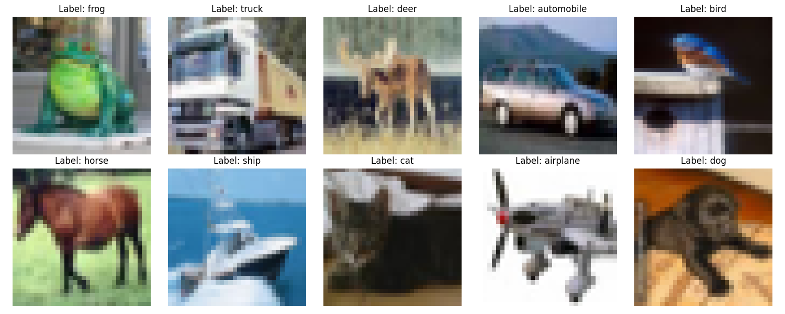

# CIFAR-10 Dataset

The CIFAR-10 dataset is a collection of images commonly used for training machine learning and computer vision algorithms.
It consists of 60,000 32x32 color images in 10 different classes, with 6,000 images per class. The dataset is divided into 50,000 training images and 10,000 test images.

## CIFAR-10 Categories

