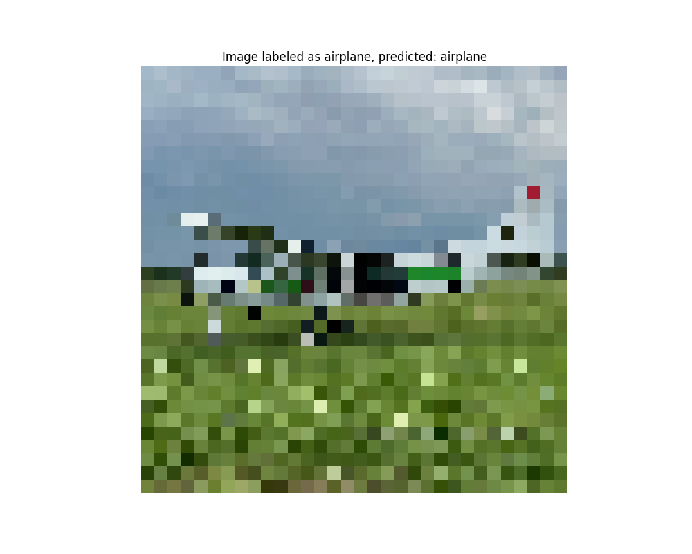

# CIFAR-10 Dataset

The CIFAR-10 dataset is a collection of images commonly used for training machine learning and computer vision algorithms.
It consists of 60,000 32x32 color images in 10 different classes, with 6,000 images per class. The dataset is divided into 50,000 training images and 10,000 test images.

## CIFAR-10 Categories

the above plot is generated with [cifar_visualization.py](cifar_visualization.py) use this script to understand the dataset structure

# CNN trained on CIFAR-10

[keras_cifar_cnn.py](keras_cifar_cnn.py)

- defines a CNN model for CIFAR-10 classification, trains it on the dataset, evaluates its performance, and visualizes the training history
- CNN model consists of three convolutional layers followed by max pooling for downsampling, concluding with two fully connected layers. It uses ReLU activation functions for feature extraction and a softmax activation for multi-class classification

[keras_predict_cifar.py](keras_predict_cifar.py)

- takes in a normal image and predicts it using the prior trained model
  
  
