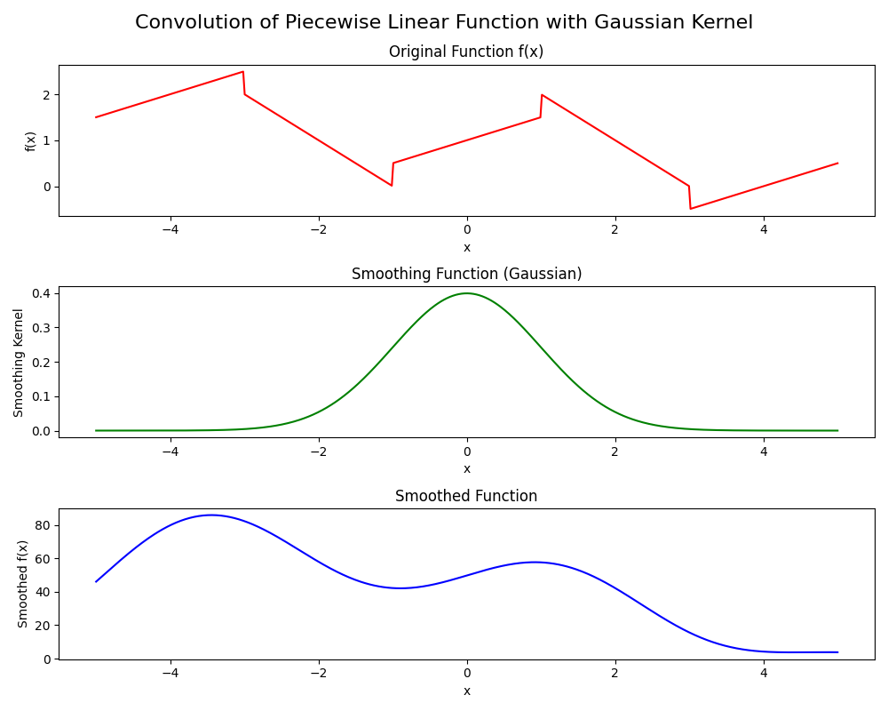

# Convolutional Neural Networks

## Kernel
In the context of signal processing and image processing, a **kernel** is a small matrix (or function) used for various operations such as convolution, smoothing, filtering, or edge detection. It defines the weights or coefficients that are applied to neighboring pixels or data points in a larger matrix or signal.

### How a Kernel Works:
1. **Convolution Operation**:
   - Convolution involves sliding the kernel (in [convolutions.py](convolutions.py), `gaussian_smooth(x, sigma=1.0)`) over the input function (`f(x)`), multiplying the kernel's values by the overlapping values in the input function, and summing these products.
   - This sliding and multiplication process is performed for every point in the input function, resulting in a smoothed output.
   

2. **Smoothing Effect**:
   - purpose of using a kernel like `gaussian_smooth(x, sigma=1.0)` is to smooth out abrupt changes or noise in the input function (`f(x)`).
   - Gaussian kernel, applies higher weights to nearby points and lower weights to farther points, creating a smooth transition between values. This helps in reducing sharp spikes or noise in the data.
       - adjustment: changing `sigma` alters the width of the Gaussian curve. Larger `sigma` values result in broader smoothing, smaller retain more detail.
   

3. **Kernel Size and Shape**:
   - size and shape of the kernel (often represented as a matrix) determine the extent and manner in which neighboring points influence each other during convolution.
   - larger kernel size considers a broader range of neighboring points -> can lead to more smoothing but may reduce sharpness of features.

4. **Kernel Usecases**:
   - Kernels are widely used in signal processing tasks such as image processing (e.g., blurring, sharpening), noise reduction, feature extraction, and edge detection.
   - They are also used in numerical methods to solve differential equations and in machine learning algorithms (i.e. CNNs).

### Specifics of `gaussian_smooth` in Your Context:

- **Gaussian Kernel**: `gaussian_smooth(x, sigma=1.0)` creates a Gaussian-shaped kernel centered at 0 with a standard deviation (`sigma`) of 1.0.
- **Purpose**: This kernel is applied to `f(x)` to smooth out its piecewise linear nature. The Gaussian shape ensures that nearby points have a significant influence on each other, leading to a smoother output function (`smoothed`).
