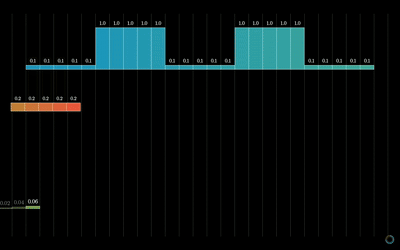
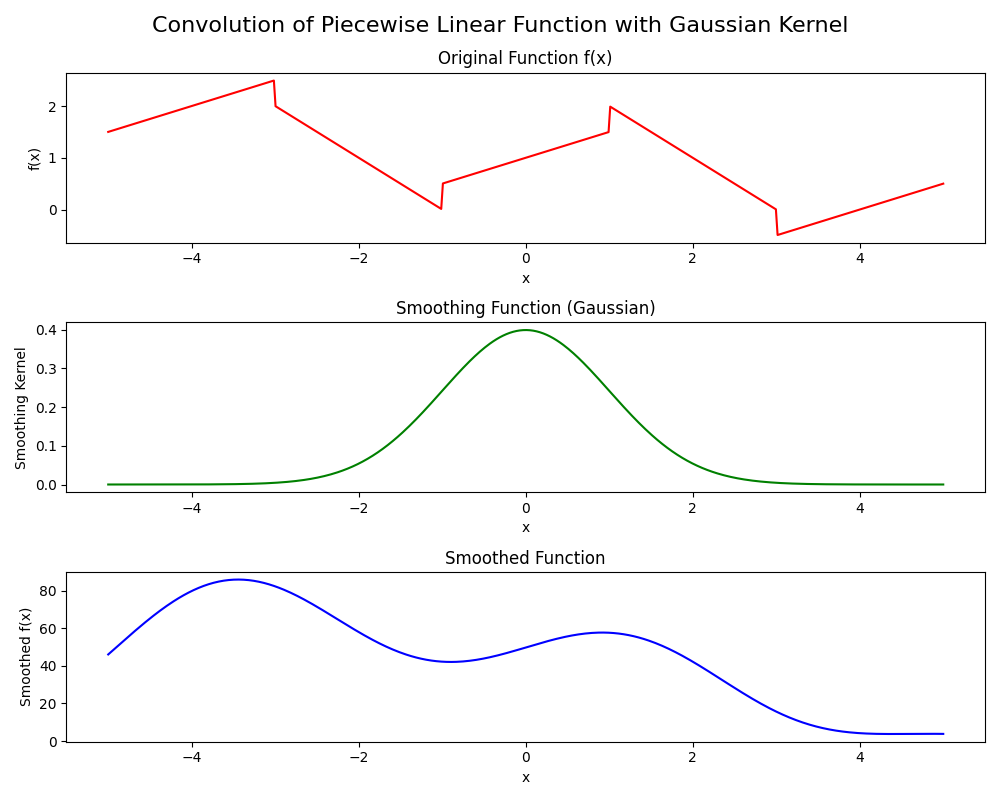
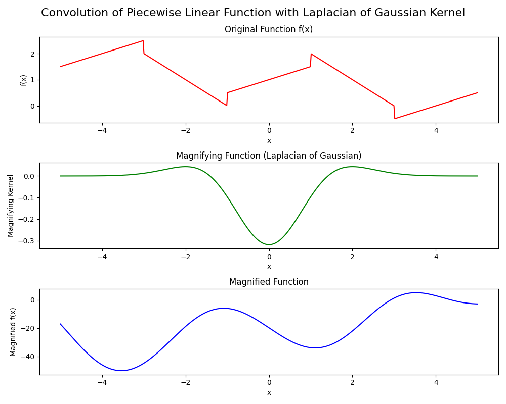

# Understanding Kernels and Tensors in Convolutional Neural Networks
    - CNNs rely on convolutional layers, which leverage the operation of convolution to efficiently learn and extract features from input data

## Overview Convolutional Layers:
### First Layer
- **Input:** An RGB image represented as a 3D tensor (height, width, channels).
- **Kernel:** A small 2D matrix defining a specific convolution operation (e.g., edge detection).
- **Convolution Operation:** The kernel slides over the input tensor, computing dot products with local regions.
- **Output:** Feature maps (output tensors) are produced, where each channel corresponds to the result of applying a specific kernel to the input tensor.
  - **Stacking Feature Maps:** as convolution is applied with multiple kernels, each kernel produces a separate feature map. These feature maps are stacked together along a new dimension to form a tensor.

### Other Convolutional Layers
- **Input:** The output feature maps (3D tensors) from the previous layer.
- **Kernels:** Another set of 2D matrices (filters) applied to each feature map.
- **Convolution Operation:** Similar to the first layer, each kernel slides over its respective input feature map, computing dot products with local regions.
- **Output:** New feature maps are generated, capturing increasingly abstract features as deeper layers are traversed in the network.

## Tensors
    - Tensors are fundamental data structures
    - Tensors can have arbitrary dimensions. 
        - Scalars are 0-dimensional tensors (0D), vectors are 1-dimensional tensors (1D), matrices are 2-dimensional tensors (2D), and tensors can extend to higher dimensions (3D, 4D, etc.).
        - An RGB image represented as a 3D tensor with dimensions (height, width, channels)

## Convolution
    - Convolution: mathematical operation that involves sliding a function (or kernel) over another function, multiplying them at each point and summing the results to produce a new function that represents the combined effect of two functions
   

## Kernels
    - **Kernel** is a small matrix (or function) used for various operations such as convolution, smoothing, filtering, or edge detection. 
        - it defines weights or coefficients that are applied to neighboring pixels or data points in a larger matrix or signal during convolution.
    - CNNs typically use multiple kernels (filters) simultaneously during convolution. 
        - each kernel detects different features or aspects of the input data like edges in different orientations or colors, depending on weights & coefficients.
    - As convolution is applied with multiple kernels, each kernel produces a separate feature map. These feature maps are stacked together along a new dimension to form a tensor.

### How a Kernel Works:
1. **Convolution Operation**:
   - Convolution involves sliding the kernel  over the input function, multiplying the kernel's values by the overlapping values in the input data and summing these products.
   - The sliding and multiplication process is performed for every point in the input data.

2. **Kernel Size and Shape**:
    - size and shape of the kernel (often represented as a matrix) determine the extent and manner in which neighboring points influence each other during convolution.
    - larger kernel size considers a broader range of neighboring points -> can lead to more smoothing but may reduce sharpness of features.

3. **Smoothing Effect**:
    - Gaussian Kernel: (in [convolutions.py](convolutions.py), `gaussian_smooth(x, sigma=1.0)`) creates a Gaussian-shaped kernel centered at 0 with a standard deviation (`sigma`) of 1.0.
        - purpose: is to smooth out abrupt changes or noise in the input function (`f(x)`).
    - gaussian kernel, applies higher weights to nearby points and lower weights to farther points, creating a smooth transition between values. This helps in reducing sharp spikes or noise in the data.
        - adjustment: changing `sigma` alters the width of the Gaussian curve. Larger `sigma` values result in broader smoothing, smaller retain more detail.
    

4. **Sharpening Effect**:
    - **Laplacian of Gaussian Kernel**: (in [convolutions.py](convolutions.py), `laplacian_of_gaussian(x, sigma=1.0)`) creates a kernel designed to detect edges and highlight rapid intensity changes. This kernel combines the second derivative (Laplacian) with a Gaussian filter.
        - **purpose**: To emphasize the extremes and highlight regions with rapid changes or high frequency content in the input function (`f(x)`).
    - **Laplacian of Gaussian Kernel**: assigns higher weights to points where there are rapid changes in the input function and lower or negative weights to smoother regions, thus highlighting transitions and edges.
        - **Adjustment**: Changing `sigma` alters the sensitivity of the kernel. Smaller `sigma` values more localized edge detection, larger `sigma` values make the kernel sensitive to broader changes.
    

5. **Kernel Usecases**:
    - Kernels are widely used in signal processing tasks such as image processing (e.g., blurring, sharpening), noise reduction, feature extraction, and edge detection.
    - They are also used in numerical methods to solve differential equations and in machine learning algorithms (i.e. CNNs).
