# Understanding Kernels and Tensors

- Convolutional Neural Networks (CNNs) rely on convolutional layers, which leverage the operation of convolution to efficiently extract features and process input data

# Contents of this README

1. [Convolution](#convolution)
2. [Tensors](#tensors)
3. [Kernels](#kernels)
4. [How a Kernel Works](#how-a-kernel-works)
   - Convolution Operation
   - Kernel Size and Shape
   - Smoothing Effect
   - Sharpening Effect
   - Pooling
5. [Kernel Usecases](#kernel-usecases)
6. [Image-processing examples](#image-processing-examples)
7. [Chaining Convolutions](#chaining-convolutional-layers)
   - First Layer
   - Other Convolutional Layers

## Convolution

- Convolution: mathematical operation that involves sliding a function (or kernel) over another function, multiplying them at each point and summing the results to produce a new function that represents the combined effect of two functions
  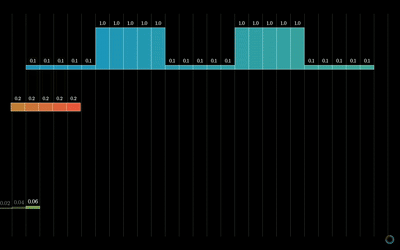

## Tensors

- Tensors are fundamental data structures
- Tensors can have arbitrary dimensions.
  - Scalars are 0-dimensional tensors (0D), vectors are 1-dimensional tensors (1D), matrices are 2-dimensional tensors (2D), and tensors can extend to higher dimensions (3D, 4D, etc.).
  - An RGB image represented as a 3D tensor with dimensions (height, width, channels)

## Kernels

- **Kernel** is a small matrix (or function) used for various operations such as convolution, smoothing, filtering, or edge detection.
  - it defines weights or coefficients that are applied to neighboring pixels or data points in a larger matrix or signal during convolution.
- CNNs typically use multiple kernels (filters) simultaneously during convolution.
  - each kernel detects different features or aspects of the input data like edges in different orientations or colors, depending on weights & coefficients.
- As convolution is applied with multiple kernels, each kernel produces a separate feature map. These feature maps are stacked together along a new dimension to form a tensor.

## How a Kernel works:

### Convolution Operation:

- Convolution involves sliding the kernel over the input function, multiplying the kernel's values by the overlapping values in the input data and summing these products.
- The sliding and multiplication process is performed for every point in the input data.

### Kernel Size and Shape:

- size and shape of the kernel (often represented as a matrix) determine the extent and manner in which neighboring points influence each other during convolution.
- larger kernel size considers a broader range of neighboring points -> can lead to more smoothing but may reduce sharpness of features.

### Smoothing Effect:

- Gaussian Kernel: (in [convolutions.py](convolutions.py), `gaussian_smooth(x, sigma=1.0)`) creates a Gaussian-shaped kernel centered at 0 with a standard deviation (`sigma`) of 1.0.
  - purpose: is to smooth out abrupt changes or noise in the input function (`f(x)`).
- gaussian kernel, applies higher weights to nearby points and lower weights to farther points, creating a smooth transition between values. This helps in reducing sharp spikes or noise in the data.
  - adjustment: changing `sigma` alters the width of the Gaussian curve. Larger `sigma` values result in broader smoothing, smaller retain more detail.

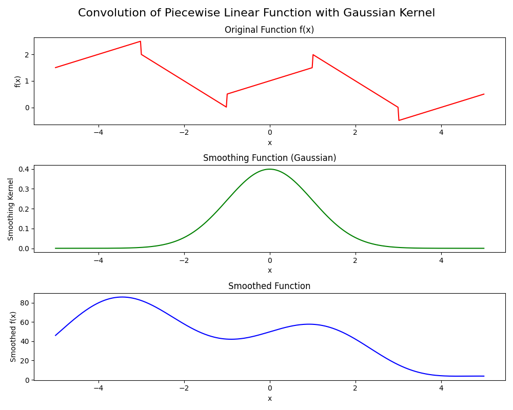

### Sharpening Effect:

- **Laplacian of Gaussian Kernel**: (in [convolutions.py](convolutions.py), `laplacian_of_gaussian(x, sigma=1.0)`) creates a kernel designed to detect edges and highlight rapid intensity changes. This kernel combines the second derivative (Laplacian) with a Gaussian filter.
  - **purpose**: To emphasize the extremes and highlight regions with rapid changes or high frequency content in the input function (`f(x)`).
- **Laplacian of Gaussian Kernel**: assigns higher weights to points where there are rapid changes in the input function and lower or negative weights to smoother regions, thus highlighting transitions and edges.
  - **Adjustment**: Changing `sigma` alters the sensitivity of the kernel. Smaller `sigma` values more localized edge detection, larger `sigma` values make the kernel sensitive to broader changes.

### Pooling

In convolutional neural networks (CNNs), pooling is a process that reduces the spatial dimensions of feature maps by summarizing smaller regions into single values.
Think of it as combining several pixels into larger ones.

**Types:**

- **Max Pooling:** Selects the maximum value from a defined window (e.g., 2x2), capturing the most prominent feature.
  - Example: For a 2x2 region [1, 3; 2, 4], max pooling would result in 4.
- **Average Pooling:** Calculates the average value from a defined window, providing a smoother representation.
  - Example: For a 2x2 region [1, 3; 2, 4], average pooling would result in (1+3+2+4)/4 = 2.5.

**Why use pooling:**
Makes the computation more efficient and robust to minor input changes by:

1. reducing the size of feature maps.
2. abstracting features.
3. providing spatial invariance.

## Kernel Usecases:

- Kernels are widely used in signal processing tasks such as image processing (e.g., blurring, sharpening), noise reduction, feature extraction, and edge detection.
- They are also used in numerical methods to solve differential equations and in machine learning algorithms (i.e. CNNs).

## Image-processing examples:

convolution-visualisation

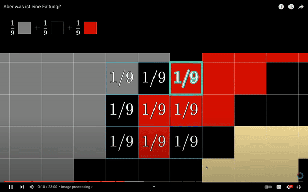

**edge-detection**

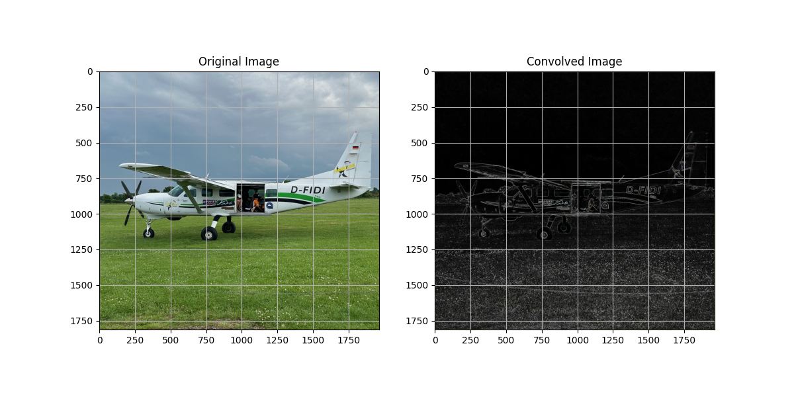

**vertical & horizontal edge detection**

  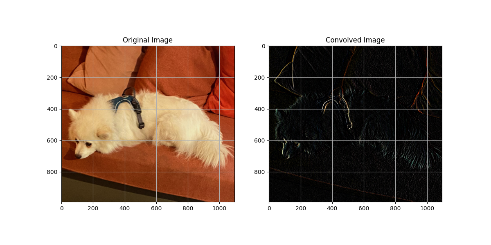
  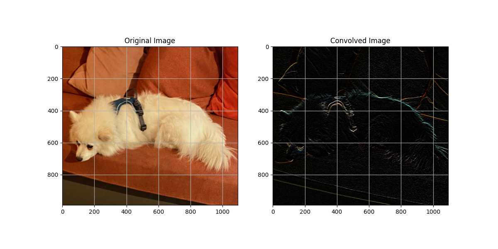

**diagonal edge detection**

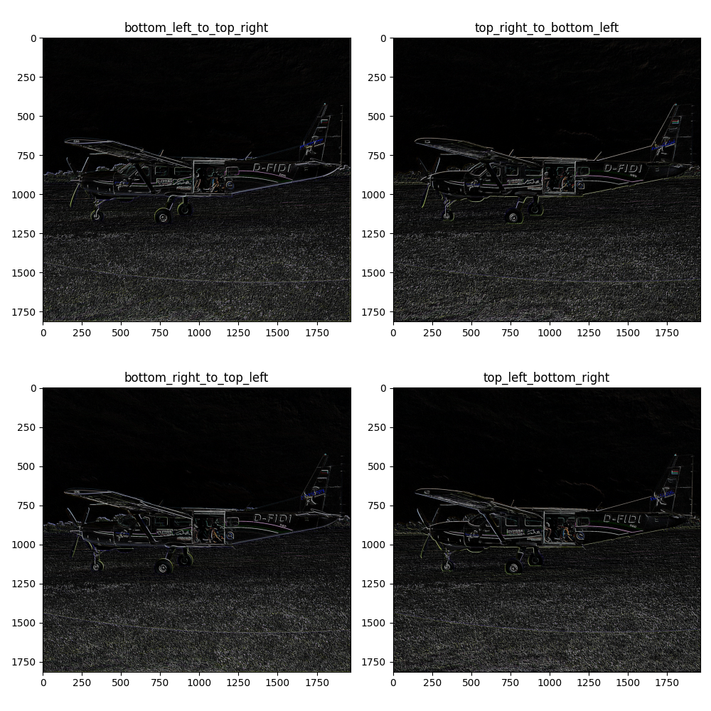

**combined edges**

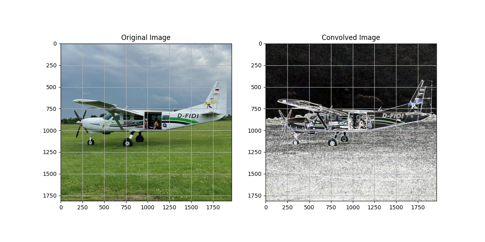

**gaussian smoothing**

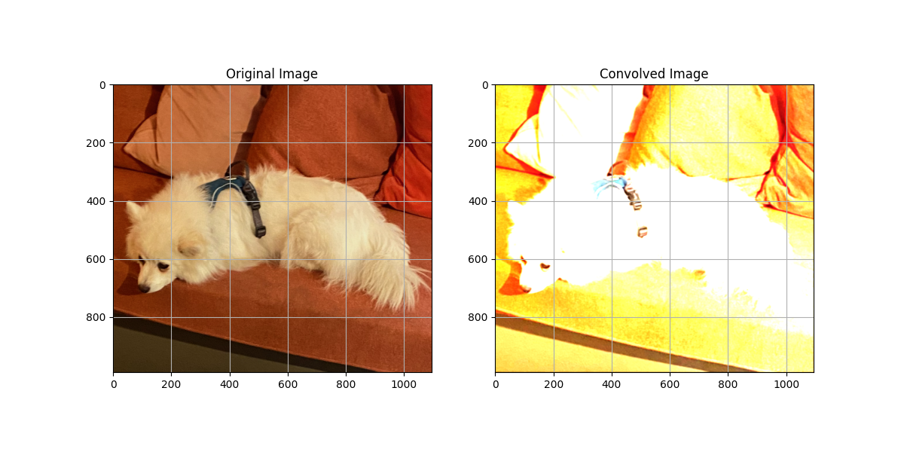

**brightening / darkening**

  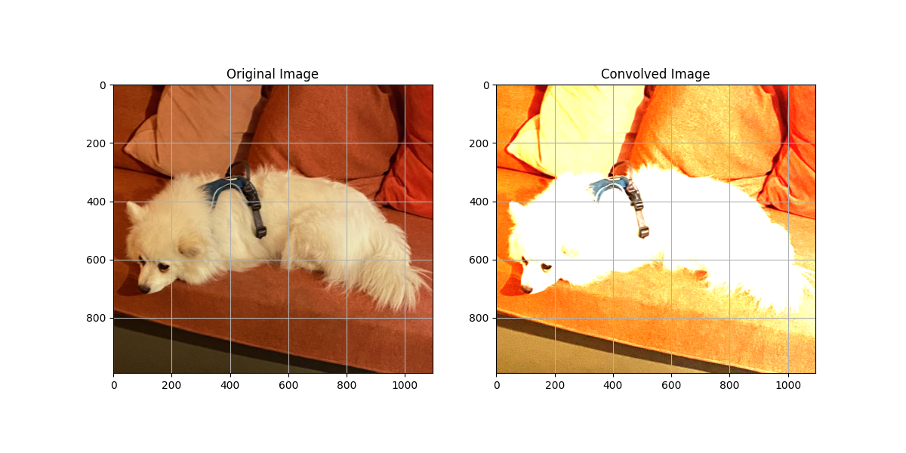
  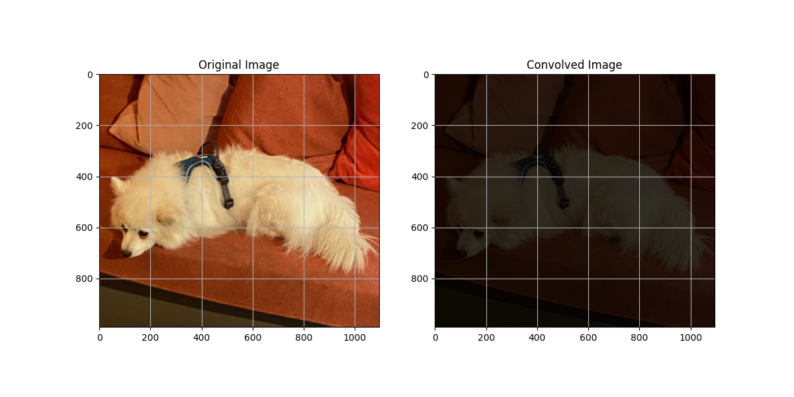

**pooling**

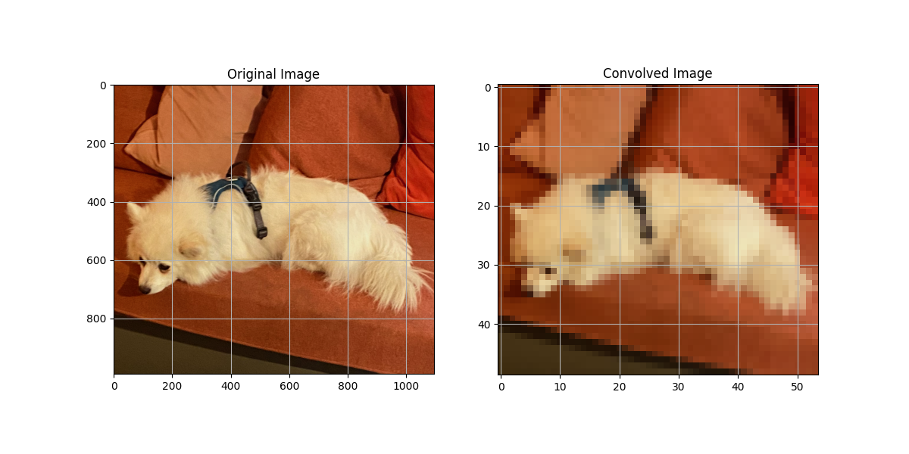

## Chaining Convolutional Layers:

in `image_processing.py` you can use the result of each convolution for pooling (line 197-198)

### First Layer

- **Input:** An RGB image represented as a 3D tensor (height, width, channels).
- **Kernel:** A small 2D matrix defining a specific convolution operation (e.g., edge detection).
- **Convolution Operation:** The kernel slides over the input tensor, computing dot products with local regions.
- **Output:** Feature maps (output tensors) are produced, where each channel corresponds to the result of applying a specific kernel to the input tensor.
  - **Stacking Feature Maps:** as convolution is applied with multiple kernels, each kernel produces a separate feature map. These feature maps are stacked together along a new dimension to form a tensor.

### Other Convolutional Layers

- **Input:** The output feature maps (3D tensors) from the previous layer.
- **Kernels:** Another set of 2D matrices (filters) applied to each feature map.
- **Convolution Operation:** Similar to the first layer, each kernel slides over its respective input feature map, computing dot products with local regions.
- **Output:** New feature maps are generated, capturing increasingly abstract features as deeper layers are traversed in the network.
